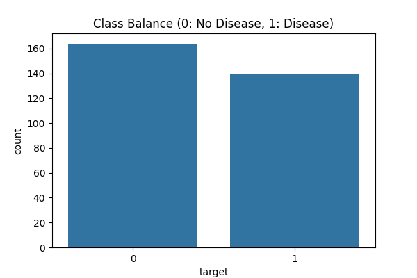
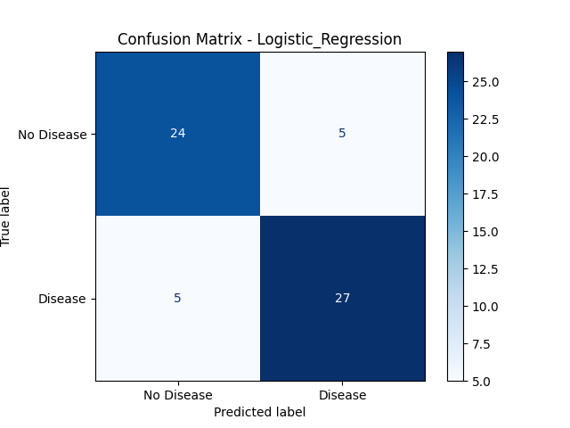
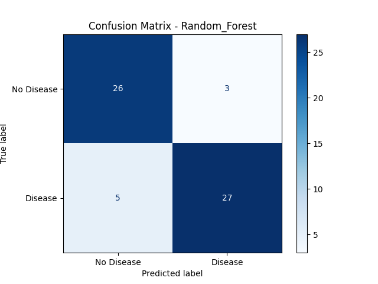
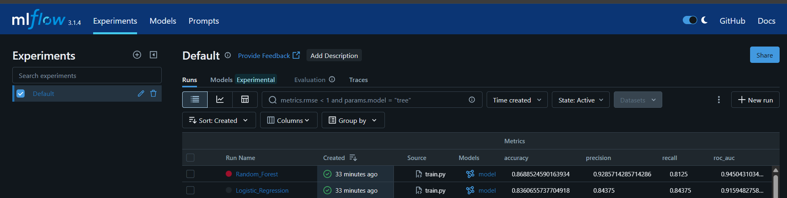
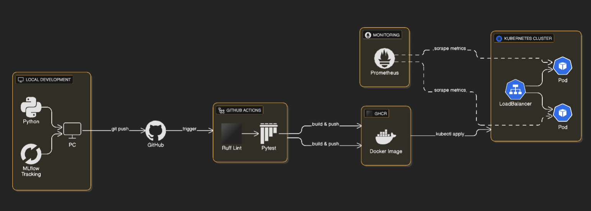
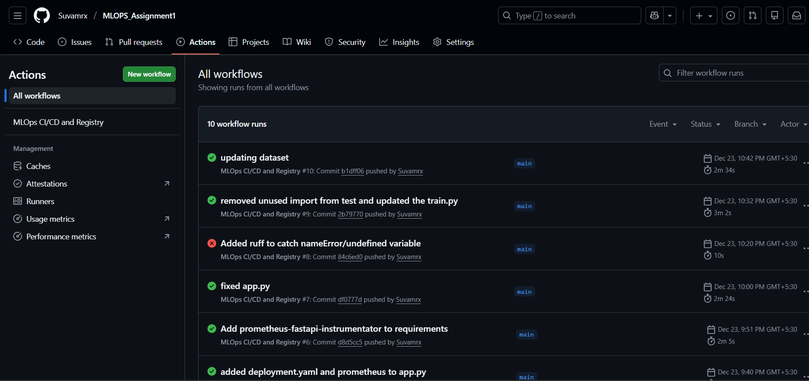
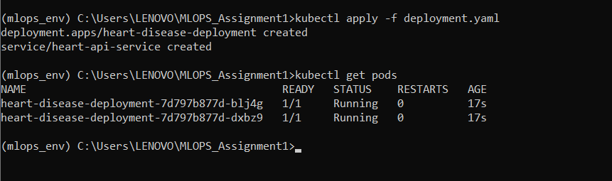
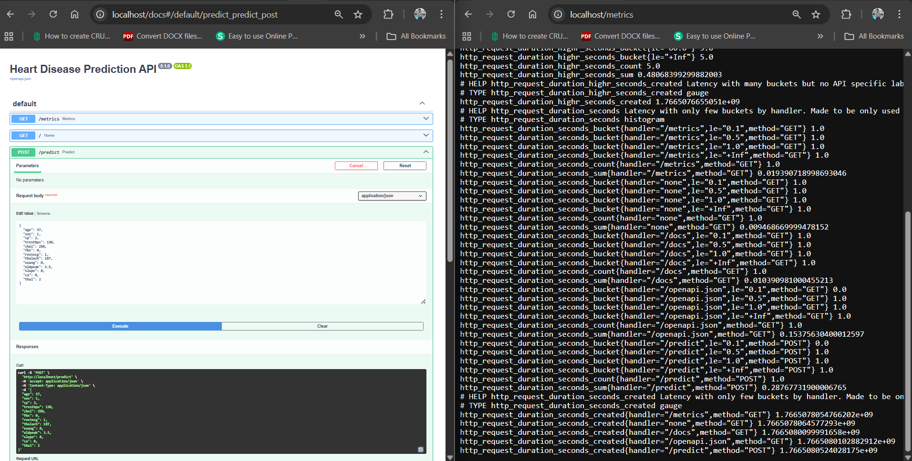

# Heart Disease Prediction: MLOps Pipeline Report

**Author:** Suvamrx  
**GitHub Repository:** [suvamrx/MLOPS_Assignment1](https://github.com/suvamrx/MLOPS_Assignment1)  
**Registry:** `ghcr.io/suvamrx/mlops_assignment1:latest`

---

## 1. Setup & Installation

The system is designed for reproducibility using a containerized approach.

- **Dependencies:** Install required packages using:

  ```bash
  pip install -r requirements.txt
  ```

- **Docker (optional):** Build and run the API locally:

  ```bash
  docker build -t heart-api:latest .
  docker run -p 8000:8000 heart-api:latest
  ```

- **Training:** Run the training script to clean the raw data, save the processed CSV, and generate the model.joblib artifact:

  ```bash
  python scripts/train.py
  ```

- **Kubernetes Deployment:** Deploy the API to your local Kubernetes cluster using the provided manifests:

  ```bash
  kubectl apply -f kubernetes/deployment.yaml
  ```

---

### **What these commands actually do:**

1.  **`python scripts/train.py`**: This executes the script we modified earlier. It looks for the raw CSV, cleans it, saves the new `processed_heart_disease.csv`, and trains the model.
2.  **`kubectl apply -f ...`**: This tells Kubernetes to read your configuration files. The `deployment.yaml` creates the pods (the "brain"), and the `service.yaml` creates the network path so you can actually visit the API in your browser.

---

## 2. EDA and Modelling Choices

### Exploratory Data Analysis (EDA)
Before training, I conducted an analysis of the UCI Heart Disease dataset to understand feature distributions and target relationships.

* **Class Balance:** As shown in the bar chart below, the dataset is relatively balanced between 'No Disease' (0) and 'Disease' (1). This balance ensures that the model evaluation metrics like Accuracy and Precision are reliable.


* **Feature Correlation:** The heatmap reveals significant correlations. Features such as `cp` (chest pain type), `thal`, and `ca` show strong positive correlations with heart disease, while `thalach` (maximum heart rate achieved) shows a strong negative correlation.


### Modelling Choices
To meet the project requirements, a robust machine learning pipeline was constructed:

* **Data Cleaning:** Missing values (marked as '?') were handled using median imputation to maintain data integrity without losing samples.
* **Preprocessing Pipeline:** I implemented a `ColumnTransformer` to ensure training-serving consistency:
    * **Numerical Features:** Normalized using `StandardScaler` to ensure the model isn't biased by feature scales (e.g., Age vs. Cholesterol).
    * **Categorical Features:** Transformed using `OneHotEncoder` to convert text/categories into machine-readable format.
* **Algorithms Compared:** 1. **Logistic Regression:** Used as a baseline for high interpretability.
    2. **Random Forest Classifier:** Selected for production as it effectively captures the non-linear interactions between health features found during EDA.

---

## 3. Experiment Tracking Summary

To manage the model lifecycle and ensure reproducibility, **MLflow** was used to track all training experiments.

### Experiment Details
* **Tool Used:** MLflow Tracking UI.
* **Parameters Logged:** Model hyperparameters (e.g., `n_estimators` for Random Forest, `max_iter` for Logistic Regression).
* **Metrics Tracked:** Accuracy, Precision, Recall, and ROC-AUC.
* **Artifacts:** For every run, the system logged the `model.joblib` and the cleaned `processed_heart_disease.csv` dataset.

### Performance Results
The comparison between the baseline and the optimized model is summarized below:

| Model | Accuracy | Precision | Recall | ROC-AUC |
| :--- | :--- | :--- | :--- | :--- |
| Logistic Regression | 0.836 | 0.843 | 0.843 | 0.915 |
| **Random Forest** | **0.868** | **0.928** | **0.812** | **0.945** |

### Model Evaluation — Confusion Matrices

Below are the confusion matrices for the trained models, showing true vs predicted labels.

**Logistic Regression**  


**Random Forest**  


> **Analysis:** The Random Forest model was selected for the production deployment due to its superior accuracy (86.8%) and excellent ROC-AUC (0.945), indicating strong discriminative power (ability to distinguish between diseased and healthy patients). This model was successfully registered and dumped to `model.joblib` for deployment.


---

## 4. Architecture Diagram

The system architecture follows a production-grade **"Push-to-Deploy"** MLOps pattern. This design ensures that every update to the model or API is automatically validated, containerized, and orchestrated.



### Architecture Overview
The pipeline is designed to eliminate "manual hand-offs." By integrating **MLflow** at the research stage and **GitHub Actions** at the deployment stage, we ensure that only models that pass quality gates (Ruff/Pytest) reach the **Kubernetes** production environment. This creates a closed-loop system where data science and software engineering are synchronized.

### Component Breakdown:
1.  **Development (Local Machine):** The project starts with local Python development. Training experiments, including hyperparameters and metrics, are tracked locally using **MLflow** to ensure reproducibility.
2.  **Source Control (GitHub):** The repository serves as the "Single Source of Truth." Any code push to the `main` branch triggers the automated CI/CD pipeline.
3.  **CI/CD Pipeline (GitHub Actions):** * **Static Analysis:** Runs **Ruff** to catch syntax errors and maintain code quality.
    * **Unit Testing:** Runs **Pytest** to ensure API endpoints and data logic are functional before deployment.
4.  **Container Registry (GHCR):** Once tests pass, the application is packaged into a Docker image and pushed to the **GitHub Container Registry (GHCR)**.
5.  **Orchestration (Kubernetes):** * The **Docker Desktop Kubernetes** cluster pulls the latest image from GHCR.
    * A **Deployment** manifest manages **2 Pod replicas** for high availability and self-healing.
    * A **Service (LoadBalancer)** provides a stable entry point for user prediction requests.
6.  **Observability:** The API integrates `prometheus-fastapi-instrumentator` to expose real-time technical metrics via the `/metrics` endpoint, allowing for continuous monitoring of system health.

---

## 5. CI/CD and Deployment Workflow Proof

This section provides visual evidence that the pipeline is fully operational, meeting the requirements for automated testing, high availability, and observability.

### Requirement: Fail-Fast CI/CD (GitHub Actions)
The GitHub Actions pipeline is configured as a "quality gate." If the code fails linting (Ruff) or testing (Pytest), the build is terminated immediately, preventing broken code from reaching the registry.



### Requirement: High Availability (Kubernetes)
To ensure the Heart Disease Prediction API remains available even if a container crashes, the Kubernetes deployment is configured with two active replicas.

* **Pods:** Two running instances of the API.
* **Service:** A LoadBalancer providing a stable entry point.




### Requirement: Real-time Monitoring & Metrics
The API exposes technical performance metrics using the Prometheus format. This allows for real-time monitoring of request latency, error rates, and system resource usage.



---
* **Inference:** Standalone script for local model testing and batch prediction:
    ```bash
    python scripts/inference.py
    ```
## 6. Conclusion
The implemented MLOps pipeline successfully bridges the gap between manual data science experimentation and automated cloud-native deployment. By leveraging **MLflow** for experiment tracking and **Kubernetes** for orchestration, the system is prepared for scalable production use with high reliability.

**Final Repository Link:** [https://github.com/suvamrx/MLOPS_Assignment1](https://github.com/suvamrx/MLOPS_Assignment1)